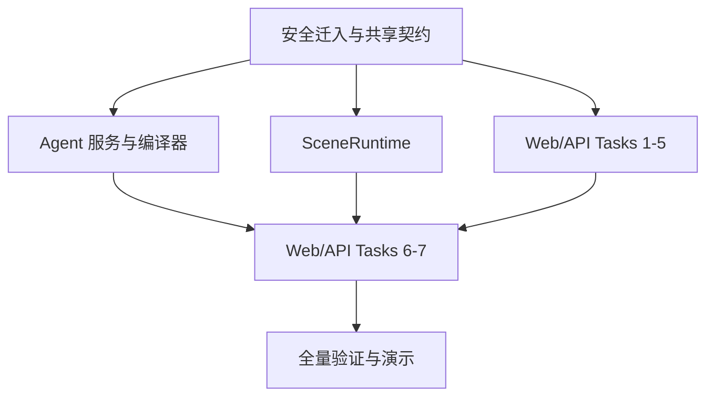

# ISE Two-Day Parallel Execution Index

日期：2026-07-15

本文件只负责任务编排。每项工作的完整需求、代码片段、测试命令和提交步骤位于对应实施计划。

## 计划集合

1. `2026-07-15-ise-foundation-import-contracts.md`
2. `2026-07-15-ise-agent-service-runtime-compiler.md`
3. `2026-07-15-ise-scene-runtime.md`
4. `2026-07-15-ise-web-api-integration.md`

## 依赖图



## Wave 0：冻结基线

执行 `ise-foundation-import-contracts` 全计划。

分支：`feat/ise-foundation-import-contracts`

worktree：`.worktrees/ise-foundation-import-contracts`

两套未跟踪底座不复制、不建立 junction。进入该 worktree 后显式指向主检出目录中的 operator source roots：

```powershell
$env:ISE_WEB_SOURCE_ROOT='E:\Github\ISE\intelligents_sceneditor_front'
$env:ISE_API_SOURCE_ROOT='E:\Github\ISE\intelligents_sceneditor_back'
node scripts/import-foundation.mjs
```

导入 receipt 和 provenance 只记录固定 source label、相对路径、大小与 SHA-256，不记录这两个绝对环境变量值。

完成门槛：

- `apps/web` 和 `apps/api` 已安全迁入；
- `.env`、构建产物、缓存、大二进制和嵌套 `.git` 未跟踪；
- 根 workspace 能安装、构建和运行现有测试；
- `npm run prisma:generate` 在类型检查和 API 构建前通过；
- 保留的 Web 源码不再导入三个被排除的旧播放 hooks，`PUBLIC_MAPBOX_TOKEN` 是唯一 Mapbox token 来源且仓库中无硬编码 `pk.*`；
- `@ise/runtime-contracts` 导出名与四份计划一致；
- 素材清单、航迹规范化和准备上传逻辑测试通过；
- 该分支通过独立规格与质量审查后合并到 `main`。

Wave 0 未合并前不得启动后续实现 worktree。

冻结的 Web/Agent 会话调用为：`POST /sessions` 无 request body；上传文件后，objective 只通过 `POST /sessions/:sessionId/messages` 的 `{ content }` 发送；Web 未提供时把目标演示时长写为默认 `180` 秒。不得把 `objective` 或 `targetDurationMs` 放回创建 Session 的 body。

## Wave 1：三个并行工作流

三个 worktree 都从 Wave 0 合并后的同一 `main` commit 创建。

### Agent 工作流

计划：`ise-agent-service-runtime-compiler`

分支：`feat/ise-agent-service-runtime-compiler`

worktree：`.worktrees/ise-agent-service-runtime-compiler`

独占：`agent/**` 和根 `package-lock.json`。

执行完整计划。NestJS 请求使用 mock/contract test；该工作流是 Wave 1 唯一允许因 Fastify/SQLite 依赖更新根 lockfile 的工作流，不得修改 `apps/**`、根 `package.json` 或共享契约。

### SceneRuntime 工作流

计划：`ise-scene-runtime`

分支：`feat/ise-scene-runtime`

worktree：`.worktrees/ise-scene-runtime`

独占：`apps/web/src/runtime/**`、`apps/web/e2e/runtime-rendering.spec.ts`

执行 Tasks 1-8，完成运行时实现、单元测试和受测 fixture；不在独立 worktree 执行 Task 9。Task 9 的 `runtime-rendering.spec.ts` 和真实浏览器运行必须等 Web/API 的 harness、真实清单与素材种子在 Wave 2 接通后再实施。不得修改页面、路由、NestJS、Agent、根 lockfile 或共享契约。

### Web/API 工作流第一阶段

计划：`ise-web-api-integration` Tasks 1-5

分支：`feat/ise-web-api-integration`

worktree：`.worktrees/ise-web-api-integration`

独占：`apps/api/**`，以及 `apps/web/src/api/**`、`apps/web/src/hooks/**`、`apps/web/src/stores/**`、`apps/web/src/pages/**`。

只执行 Tasks 1-5。不得创建 SceneRuntime 内部实现，不得执行依赖真实 runtime 的 Task 6，不得修改 Agent、根 lockfile 或共享契约。

## Wave 1 审查与合并

每个实现工作流完成后：

1. 读取工作流报告和测试证据；
2. 生成从共同基线到分支 HEAD 的完整 review package；
3. 派发独立规格与代码质量审查；
4. 修复所有 Critical 和 Important 问题并重新审查；
5. 主代理复核该分支未越过文件所有权；
6. 按 Agent、SceneRuntime、Web/API 第一阶段顺序合并；
7. 每次合并后运行受影响 workspace 的类型检查和测试。

三条分支互相独立，不允许通过复制其他 worktree 的未提交文件建立隐式依赖。

## Wave 2：接线与端到端

更新 `feat/ise-web-api-integration` 到 Wave 1 全部合并后的 `main`，先执行 Web/API Task 6，再执行 Task 7 的真实清单、校准和种子流程，随后执行 SceneRuntime Task 9，最后完成 Web/API Task 7 的全量验收与 runbook。

范围：

- `/runtime-harness` 与 Playwright webServer；
- 在 harness、真实清单和素材种子接通后执行 SceneRuntime Task 9 的桌面/移动画布像素验收；
- SceneCanvas、编辑器和 Preview 接入 SceneRuntime；
- Agent 真实 Session 到 Scene 创建的完整链路；
- 当前报告、至少一个额外报告和真实素材验收；
- 根 `verify` 与 `verify:e2e`；
- 演示 runbook。

Wave 2 完成后执行一次覆盖合并基线到最终 HEAD 的全分支代码审查。

## 并发与通信规则

- 主代理占用一个并发槽，最多三个实现代理并行；
- 子代理使用 `executing-plans` 按各自计划连续执行，不在任务之间等待人工确认；
- 接口问题发送给主代理，由主代理统一修改共享契约或作出解释；
- 子代理不得自行修改其他工作流的计划或契约；
- 共享契约变化必须形成独立主代理提交，并通知三个工作流同步；
- 每个工作流的完成状态、commit 范围和审查结果写入 `.superpowers/sdd/progress.md`；
- 合并和最终验证只由主代理执行。

## 终止条件

出现下列任一情况时暂停对应工作流，但不阻断其他独立工作流：

- 计划要求与冻结契约矛盾；
- 需要修改不属于本工作流的文件；
- 真实 GLB 无法加载或航迹规范化失败；
- 关键资源指纹、MIME 或授权无法验证；
- 测试无法在隔离 worktree 中复现；
- 用户需要作出会改变产品行为的选择。

只有规格中的 12 项完成标准全部验证后，整个两天目标才可标记完成。
