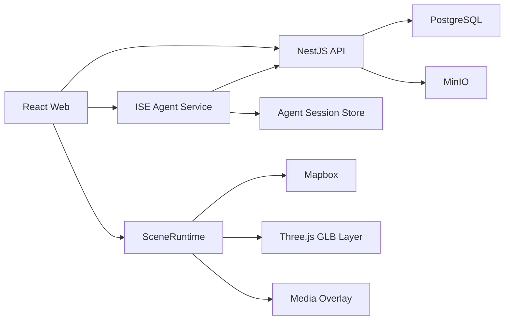

# ISE 底座接入、媒体轨道与三维运行时设计

日期：2026-07-15

状态：设计已完成讨论，等待书面规格审阅

关联设计：`docs/superpowers/specs/2026-07-14-ise-agent-design.md`

## 1. 背景与现状

ISE 已完成第一阶段 Agent 基础能力，包括从 GSMS 独立复制的通用 Agent Runtime、Skill Runtime、DOCX 解析、稳定证据引用、EventPlan 草案、版本管理和精确确认。

新接入的底座由三部分组成：

- React 19、Rsbuild、Zustand 和 Mapbox 前端；
- NestJS、Prisma、PostgreSQL、MinIO 和 Redis 后端；
- FastAPI、LangGraph 和知识库组成的旧 Python Agent。

底座已经具备认证、文件和项目 CRUD、素材管理、脚本审阅界面、地图画布、时间轴界面和属性面板，但当前端到端链路仍由 mock 数据驱动：

- 新脚本页固定等待并返回预置战役 JSON；
- 转换场景跳转到写死的项目 ID；
- 时间轴忽略父组件传入的轨道，继续渲染内置 JSON；
- 预览页只切换播放图标，不执行轨道；
- GLB 运动 hooks 依赖不存在的 `modelManager`；
- 视频只有预览和参数编辑，没有真实时间同步；
- 旧 Python Agent 实际只有固定的 `intro -> outline`，接口与前端流协议不兼容。

本设计在两天内建立一条真实纵向链路：

```text
上传同类空战复盘 DOCX
-> 生成带证据 EventPlan
-> 用户审阅并确认精确版本
-> 生成 NarrativePlan
-> 确定性编译 RuntimePlan
-> 适配为底座场景配置
-> 在 Mapbox 中播放字幕、图片、视频、地理图层、相机和 GLB 航迹
```

## 2. 已确认决策

1. 保留独立 TypeScript ISE Agent 服务，不把 Agent 内核并入 NestJS。
2. NestJS 继续负责认证、文件、MinIO、脚本、场景和最终项目持久化。
3. 旧 Python Agent 和 `front_OLD` 不进入新运行时，只作为参考来源。
4. 不恢复旧 Threebox 播放器；使用 Mapbox Custom Layer、Three.js 和 GLTFLoader 建立受控三维运行时。
5. GLB 飞机和导弹必须沿已注册 JSON 航迹运动，并自动跟随航向。
6. 视频作为地图画布上的可配置叠层，画中画和全屏使用同一协议。
7. 增加图片轨道；图片与视频共享叠层布局模型。
8. 播放、暂停、拖动和重播必须确定性恢复地图、模型、视频、图片、字幕和相机状态。
9. 两天版本不实现 TTS、独立音频轨、碰撞、物理弹道、骨骼动画、自由路径规划或视频导出。
10. 实施可使用并行子代理，但共享契约先冻结，各工作流必须具有互斥文件所有权并接受独立审查。

## 3. 目标与非目标

### 3.1 两天目标

- 当前报告能够生成 5 至 10 个非固定 EventUnit；
- EventUnit 和字幕可以查看原文证据；
- 用户可以修改、删除、排序和批准 EventPlan；
- 批准绑定 `artifactId + version + fingerprint`；
- Agent 输出经校验的 CanonicalRuntimePlan；
- 底座使用版本化 SceneProjectConfig，不再读取 mock；
- 支持字幕、图片、视频、Marker、GeoJSON、相机和 GLB 模型轨道；
- GLB 沿预设航迹运动并跟随朝向；
- 视频、图片和字幕与统一播放时间同步；
- 场景能够保存、重新打开、播放、暂停、拖动和重播；
- 关键资源失败时系统不宣称生成成功。

### 3.2 非目标

- 任意领域文档理解；
- 任意未知 GLB 自动适配；
- 网络资源自动搜索和下载；
- 真实空战物理仿真或战果核定；
- 模型骨骼动画和碰撞；
- 自由生成编辑器代码；
- 多 Agent 业务协作图；
- 恢复旧 Threebox、旧 store 或旧播放器全量代码；
- 第二天下午增加新的轨道类型。

## 4. 服务边界



### 4.1 React Web

负责：

- Agent 会话和 SSE 消费；
- EventPlan 审阅与修订；
- Artifact 结果展示；
- 场景时间轴和属性编辑；
- SceneRuntime 生命周期；
- 创建和保存最终 Scene 项目。

Web 不保存模型供应商密钥，不把浏览器状态作为权威持久层。

### 4.2 NestJS API

负责：

- JWT 身份与文件所有权；
- DOCX、MP4、图片、GLB、GeoJSON 和航迹 JSON 上传；
- PostgreSQL 中的用户、文件、Script 和 Scene；
- MinIO 对象存储；
- 向 Agent 提供受限内部文件接口或短期签名 URL；
- 保存已验证的 SceneProjectConfig。

NestJS 不执行模型循环，不包含叙事规划规则，不直接控制播放器。

### 4.3 ISE Agent Service

负责：

- Session、Run、Event、Artifact 和 Review；
- 模型和工具循环；
- 文档解析和证据查询；
- EventPlan、NarrativePlan 和 SceneRequirementPlan；
- AssetRegistry 查询；
- CanonicalRuntimePlan 编译与校验；
- BaseRuntimeAdapter。

Agent 接收 Web 转发的 NestJS Bearer token，通过 NestJS 鉴权校验接口获得用户 subject，并将 subject 绑定到 Session。后续 Session、Artifact、Review 和文件访问都校验同一 subject。Agent 通过携带该身份的内部文件请求读取授权文件 ID，不共享 NestJS 数据库账号，不直接更新用户 Scene。

### 4.4 SceneRuntime

SceneRuntime 属于 Web 工程，但与 React UI 解耦。它只接受已校验的 SceneProjectConfig，负责确定性执行，不参与语义生成。

## 5. 仓库结构与导入策略

目标结构：

```text
ISE/
  apps/
    web/
    api/
  agent/
  packages/
    agent-core/
    skills-core/
    runtime-contracts/
  docs/
  provenance/
```

底座使用选择性迁入：

- 当前前端源码迁入 `apps/web`；
- 当前 NestJS 源码和 Prisma 迁入 `apps/api`；
- `.env`、`dist`、日志、缓存、`node_modules` 和嵌套 `.git` 不迁入；
- 旧 Python Agent 和 `front_OLD` 暂不纳入构建；
- 来源、原路径和选择理由记录在 provenance 文档中。

大体积 MP4、GLB 和地理数据不进入 Git 或 Git LFS。仓库保存 MinIO 种子清单、文件指纹、必要元数据、小型测试样本和导入脚本；导入脚本从操作人员提供的本地素材目录上传并验证清单。这样演示素材位置可以变化，但 `assetId` 和指纹保持稳定。

统一运行时要求 Node.js `>=20.19.0`。所有服务提供 `.env.example`，真实密钥不得提交。

## 6. 核心数据链

```text
DocumentIR
-> EvidenceIR
-> EventPlan draft
-> 用户确认
-> NarrativePlan
-> CanonicalRuntimePlan
-> BaseRuntimeAdapter
-> SceneProjectConfig v1
-> Timeline + SceneRuntime
```

现实事件时间与演示播放时间始终分离。模型不直接生成精确播放参数或底座命令；调度器根据字幕、模板、资产和能力约束确定性计算播放时间。

## 7. 共享运行时契约

新增 `@ise/runtime-contracts`，使用 Zod 定义并向 Agent 和 Web导出类型及 JSON Schema。

### 7.1 SceneProjectConfig

```ts
interface SceneProjectConfig {
  schemaVersion: 'ise-scene/v1'
  sourceDocumentId: string
  eventPlanArtifactId: string
  runtimePlanArtifactId: string
  totalDurationMs: number
  entities: SceneEntity[]
  tracks: SceneTrack[]
  diagnostics: Diagnostic[]
}
```

### 7.2 SceneTrackItem

```ts
interface SceneTrackItem {
  id: string
  eventUnitId: string
  startMs: number
  durationMs: number
  assetId?: string
  evidenceRefs: string[]
  params: Record<string, unknown>
}
```

### 7.3 轨道类型

两天版本固定支持：

```text
subtitle
image
video
marker
geojson
camera
model
```

模型命令固定支持：

```text
model.spawn
model.follow_path
model.set_state
model.hide
```

图片参数包括位置、尺寸、透明度、层级、适配方式、全屏和进出场效果。视频复用这些布局参数，并增加音量、播放速度、循环和媒体时间。

前端时间轴、属性编辑、保存和播放器消费同一份 SceneProjectConfig。旧 mock JSON、临时 NormandyData 和与保存状态分离的 `mappedTracks` 不再作为运行数据源。

## 8. AssetRegistry

RuntimePlan 只能引用稳定 `assetId`，不能包含裸本机路径或任意外部 URL。

示例：

```text
model:rafale
model:jf17
model:su30mki
model:pl15e
trajectory:ambala-rafale-1
video:missile-impact
image:ooda-overview
```

每项资源记录：

- kind、displayName、aliases 和 fingerprint；
- MinIO object key；
- format、size 和 availability；
- 模型 scale、rotationOffset、altitudeOffset 和 entityTypes；
- 航迹时间单位、坐标顺序、时间范围和单调性；
- 视频时长、编解码信息和 poster；
- 图片尺寸和适配方式；
- fallbackAssetIds 和是否允许降级。

JF-17、J-10CE 等报告、航迹和模型命名冲突必须显式记录，不允许 Agent 猜测映射。

## 9. Agent Session 与审阅

### 9.1 最小接口

```text
POST /sessions
POST /sessions/{id}/attachments
POST /sessions/{id}/messages
GET  /sessions/{id}
GET  /sessions/{id}/events
GET  /sessions/{id}/artifacts
POST /sessions/{id}/reviews/{reviewId}/approve
POST /sessions/{id}/reviews/{reviewId}/reject
POST /sessions/{id}/event-plans/{artifactId}/revisions
POST /sessions/{id}/interrupt
```

### 9.2 状态机

```text
idle
-> queued
-> running
-> awaiting_review
-> queued
-> running
-> completed | failed | cancelled
```

### 9.3 审阅规则

1. EventPlan 草案生成后必须暂停。
2. 前端显示 EventUnit、来源、推断、警告和不确定信息。
3. 修改标题、顺序、正文或删除事件都创建新版 Artifact。
4. 批准绑定精确 `artifactId + version + fingerprint`。
5. 批准后只重算 NarrativePlan、RuntimePlan 和场景配置。
6. 已批准内容变化后必须生成新版本并重新确认。

### 9.4 事件流

SSE 只发送可见活动和结构化结果：

```text
run.started
tool.started
tool.progress
artifact.created
review.requested
review.resolved
compile.progress
run.completed
run.failed
```

事件不包含隐藏推理链。Web 使用 fetch-based SSE，以便在请求头携带 Bearer token；客户端使用事件 ID恢复断线期间的事件。两天版本使用 SQLite 保存 Session、Run、Event、Artifact 和 Review，并通过存储接口隔离未来 PostgreSQL 迁移。

## 10. SceneRuntime

### 10.1 对外接口

```ts
interface SceneRuntime {
  load(config: SceneProjectConfig): Promise<void>
  play(): Promise<void>
  pause(): void
  seek(timeMs: number): Promise<void>
  replay(): Promise<void>
  dispose(): void
}
```

### 10.2 内部组件

```text
PlaybackClock
ResourceManager
MapRuntime
ModelRuntime
OverlayRuntime
```

`PlaybackClock` 使用 `requestAnimationFrame`，是唯一业务时间源。各轨道不得创建独立播放计时器。

`ResourceManager` 使用当前 Bearer token 和 `assetId` 调用 NestJS 资源解析接口，获得短期签名 URL；随后预加载资源、缓存 GLB 模板、管理引用计数并释放 Object URL。SceneProjectConfig 本身不保存签名 URL。

`MapRuntime` 管理 Marker、GeoJSON 点线面、动态航迹线、相机、图层生命周期和清理。

`OverlayRuntime` 管理字幕、图片、视频和信息卡。图片和视频共享布局模型；视频时间按播放头确定：

```text
video.currentTime = (playheadMs - startMs) / 1000 * playbackRate
```

第一次媒体播放必须来自用户交互，以满足浏览器自动播放限制。

### 10.3 ModelRuntime

ModelRuntime 使用 Mapbox Custom Layer 与 Three.js 共享 WebGL 上下文，并通过 GLTFLoader 加载 GLB。

规则：

- 每个 GLB 只加载一次，实体使用克隆实例；
- 航迹在导入时统一为带相对毫秒时间的经纬高点列；
- 每帧根据播放头二分定位前后轨迹点；
- 对经度、纬度和高度进行插值；
- 使用相邻点方位计算 heading；
- 使用高度变化计算可选 pitch；
- 应用 AssetRegistry 的 scale、rotationOffset 和 altitudeOffset；
- 使用 Mapbox MercatorCoordinate 转换地理位置；
- 支持 normal、warning、disabled 和 hidden 状态；
- 模型运动不依赖一次性 `followPath()` 定时器。

### 10.4 Seek 与恢复

```text
记录拖动前播放状态
-> 暂停统一时钟
-> 计算目标时刻有效项目
-> 隐藏或清理无效项目
-> 加载缺失资源
-> 重算地图图层、模型位置和模型状态
-> 校正视频 currentTime
-> 更新图片、字幕和相机
-> 按原状态决定是否继续播放
```

`replay()` 等价于 `seek(0)` 后播放。切换项目时 `dispose()` 必须释放 WebGL 对象、媒体元素、Object URL、动画帧和事件监听器。

## 11. 错误处理和降级

统一诊断结构：

```ts
interface Diagnostic {
  code: string
  severity: 'warning' | 'error'
  recoverable: boolean
  eventUnitId?: string
  commandId?: string
  assetId?: string
  message: string
}
```

失败规则：

- DOCX 损坏、EventUnit 无证据、Schema 错误：阻止后续生成；
- GLB、航迹或关键视频缺失：阻止发布，保留已有 Artifact；
- 非关键图片缺失：允许降级为信息卡并产生 warning；
- GLB 只有协议显式允许时才能降级为 Marker；
- 航迹倒序、坐标越界或映射冲突在编译前失败；
- 视频解码失败只停止对应轨道并显示错误；
- Agent、NestJS 和 Web 使用正确 HTTP 状态码；
- 最后一个通过校验的 RuntimePlan 继续保留。

## 12. 安全边界

- Agent 只能读取当前用户授权的文件 ID或短期签名 URL；
- 文件按 magic、MIME、扩展名、大小和指纹联合校验；
- Agent 不得读取任意本机路径、请求任意外部 URL 或执行 shell；
- 模型密钥仅存在于 Agent 服务；
- `.env`、数据库密码、Mapbox token 和 MinIO 密钥不得进入 Git；
- Review 批准动作必须绑定用户身份和精确 Artifact；
- 运行时只执行注册命令类型，未知命令直接拒绝；
- SceneProjectConfig 保存前和读取后均需 Schema 校验。

## 13. 测试策略

### 13.1 合约测试

- IR、RuntimePlan 和 SceneProjectConfig 的合法与非法输入；
- `additionalProperties` 拒绝；
- schemaVersion 不兼容；
- 毫秒时间、稳定 ID 和证据引用。

### 13.2 航迹和模型测试

- 时间归一化、单调性和重复点；
- 坐标范围和经纬度顺序；
- 插值首点、中点和尾点；
- heading 与模型 rotationOffset；
- 暂停、seek、replay 后位置一致；
- GLB header、版本和声明长度。

### 13.3 Overlay 测试

- 图片进入和离开有效区间；
- 视频 currentTime、暂停、seek 和 playbackRate；
- 全屏和画中画共用布局；
- 字幕、图片和视频层级稳定。

### 13.4 Agent 测试

- 无证据 EventUnit 拒绝；
- EventPlan 修订创建新版本；
- 精确确认绑定；
- 资源缺失和禁止降级；
- RuntimePlan 编译失败时不宣称完成；
- Session 中断和 SSE 断线恢复。

### 13.5 端到端测试

```text
上传 DOCX
-> EventPlan
-> 修改并批准
-> RuntimePlan
-> 创建 Scene
-> 打开编辑器
-> 播放、暂停、拖动和重播
```

使用 Playwright 在桌面和移动视口检查 Mapbox/Three.js 画布非空、GLB 可见、视频和图片不遮挡关键控件，并执行 canvas 像素检查。

真实素材验收覆盖当前 6 个 GLB、8 个 MP4 和主要航迹 JSON；完整演示至少包含 JF-17、阵风、导弹三类模型以及两段视频。

## 14. 两天实施计划

### 14.1 第一个 4 小时

- 选择性迁入 Web 和 API；
- 建立根工作区、环境模板和构建基线；
- 校验真实资产；
- 在真实 Mapbox 中加载飞机和导弹 GLB；
- 验证航迹插值、模型朝向和一个视频叠层。

该关口未通过时优先修复播放器，不继续增加 Agent 下游功能。

### 14.2 第一天剩余时间

- 完成 runtime-contracts；
- 实现 SceneProjectConfig；
- 让时间轴消费真实轨道；
- 完成 PlaybackClock、ResourceManager、MapRuntime、ModelRuntime 和 OverlayRuntime；
- 完成字幕、图片、视频、地理图层、相机和 GLB；
- 接通 Scene 保存与重新加载。

第一天完成标准：

```text
手工 SceneProjectConfig
-> 时间轴
-> GLB 航迹运动
-> 视频、图片和字幕同步
-> 保存并重新打开
-> 重播结果一致
```

### 14.3 第二天上午

- 增加 Agent HTTP、SQLite Session 和 SSE；
- 接通受限文件 ID和 AssetRegistry；
- 前端替换伪等待和 mock 返回；
- 展示、修订和批准 EventPlan；
- 实现 NarrativePlan、受限模板编译和 BaseRuntimeAdapter；
- 创建真实 Scene。

第二天中午完成标准：

```text
上传 DOCX
-> EventPlan
-> 用户批准
-> RuntimePlan
-> 创建真实 Scene
-> 打开并播放
```

### 14.4 第二天下午

- 只进行集成、真实素材映射、同步校正、测试和错误修复；
- 使用额外同类报告验证 EventPlan 不固定；
- 冻结功能并准备可重复演示流程；
- 不增加轨道类型或新的智能阶段。

## 15. 并行子代理策略

并行开发必须在底座安全迁入、首次基线提交、runtime-contracts 和文件所有权冻结后开始。未跟踪的底座源码不能直接作为 worktree 输入。最多同时运行三个实现工作流，由主代理负责共享契约、集成、审查和最终验证。

### 15.1 主代理

拥有：

- 根工作区和构建配置；
- `packages/runtime-contracts`；
- SceneProjectConfig 和公共接口决策；
- 资产注册表格式；
- 跨工作流集成；
- 全量测试和最终代码审查。

### 15.2 Agent 服务工作流

独占范围：

- `agent/src/session`；
- `agent/src/api`；
- NarrativePlan、RuntimePlan、AssetRegistry 和编译工具；
- Agent 服务测试。

不修改 Web、NestJS 或共享契约。

### 15.3 SceneRuntime 工作流

独占范围：

- `apps/web/src/runtime`；
- Three.js、航迹、媒体叠层和播放时钟；
- Runtime 单元测试和浏览器渲染测试。

不修改页面、NestJS、Agent 或共享契约。

### 15.4 Web 与 NestJS 接入工作流

独占范围：

- `apps/web/src/pages`、API clients 和 stores；
- `apps/api/src` 和 Prisma 迁移；
- 文件授权桥、Scene 保存和 EventPlan 审阅 UI；
- 对应集成测试。

不修改 SceneRuntime 内部、Agent 内部或共享契约。

### 15.5 集成规则

- 三个实现工作流各自使用从同一基线提交创建的独立 worktree 和分支；
- 每项任务先写失败测试，再实现；
- 每个工作流提交前自查；
- 主代理对每个工作流执行规格符合性和代码质量审查；
- 发现共享契约缺口时由主代理统一修改，再通知各工作流；
- 不允许多个子代理同时修改根 lockfile、共享契约或同一迁移；
- 合并后运行全量测试和真实浏览器验收。

## 16. 完成标准

实现完成必须同时满足：

1. 底座源码已安全迁入，真实密钥和构建产物未提交；
2. Web、API、Agent 和共享包能够使用统一命令构建与测试；
3. 当前报告和额外报告生成不同且有证据的 EventPlan；
4. 用户确认绑定精确 EventPlan 版本；
5. Agent 生成经 Schema、资产和能力校验的 RuntimePlan；
6. 时间轴、属性编辑、保存和播放器使用同一 SceneProjectConfig；
7. GLB 沿注册航迹运动并正确跟随朝向；
8. 视频和图片轨道与统一播放时间同步；
9. 播放、暂停、拖动和重播恢复正确状态；
10. GLB、航迹或关键视频失败时不会宣称生成成功；
11. 当前案例可重复完成从 DOCX 到场景播放的完整演示；
12. 全量自动化测试和 Playwright 画布验收通过。
