# DOCX 字幕驱动高表现力场景生成架构设计

日期：2026-07-16

状态：设计和现有航迹优先修订均已确认

关联设计：

- `设计.md`
- `基于证据约束与事件单元的叙事驱动型地理场景智能生成总体方案.md`
- `docs/superpowers/specs/2026-07-14-ise-agent-design.md`
- `docs/superpowers/specs/2026-07-15-ise-base-integration-runtime-design.md`

## 1. 背景与问题

当前系统已经打通真实纵向链路：

```text
DOCX
-> EventPlan
-> NarrativePlan
-> CanonicalRuntimePlan
-> SceneProjectConfig
-> Preview 播放
```

该链路已经能够播放字幕、图片、视频、相机和沿航迹运动的 GLB，并能保证证据引用、版本确认、资源校验和确定性回放。但当前生成结果的表现力明显低于人工编辑工程。

对当前自动场景与人工编辑的印巴工程进行结构化比较后，根因不是播放器只能显示一个模型，而是现有领域编译器把复杂事件压缩成了单实体模板：

- EventPlan 和 NarrativePlan 能识别“苏-30MKI 编队”“阵风编队”“JF-17 编队”“导弹发射”“目标受损”等语义；
- `sceneCompiler` 对每个 SceneRequirement 只选择第一个拥有模型的焦点实体；
- 每个移动模板固定生成一组 `model.spawn + model.follow_path`；
- 编队没有数量、成员、长机/僚机、队形和生命周期；
- 攻击链没有生成发射者、导弹和目标之间的可执行关系；
- 现有相机按事件生成单个静态镜头，而不是围绕字幕和演员行为进行导演；
- 当前 SceneProjectConfig 只有七类轨道，不能直接表达数据链、视觉效果和音频；
- 当前资源注册表只有少量固定航迹，无法支持普通 DOCX 生成多演员运动。

人工工程本质上是一份已经完成演员展开、航迹设计、镜头设计和媒体编排的导演时间线。架构升级的目标不是复制该 JSON 的具体 UUID 或未经证据支持的数量，而是让系统从 DOCX、证据和领域默认策略中自动完成同类导演工作。

## 2. 目标

系统需要从同类空战复盘 DOCX 生成可审核、可解释、可编辑和可播放的高表现力场景，并满足以下目标：

1. 字幕先于场景生成，主要视觉内容由字幕驱动；
2. DOCX 明确提供的实体数量必须严格遵守；
3. 数量缺失时使用版本化领域默认值，并明确标记为示意内容；
4. 编队必须展开为具有稳定身份、队形和生命周期的多个 ActorInstance；
5. 导弹、数据链、雷达、干扰、受损和撤离必须成为正式行为，而不是字幕中的文字；
6. 系统优先从已登记航迹目录分配真实已有航迹；只有没有可匹配航迹时，才允许经显式审核确定性生成可复现的示意航迹；
7. 镜头围绕字幕关注对象和演员当前位置生成；
8. 所有主要视觉 Beat 都能够追溯到字幕、EventUnit 和证据或默认策略；
9. 用户可以在场景蓝图阶段审核数量、演员、默认值和表现策略；
10. 用户局部修改后只重算受影响的下游产物；
11. 当前 SceneProjectConfig v1 和已有 Scene 继续可读；
12. 核心协议不依赖旧人工 JSON 中的数据库 UUID。

## 3. 非目标

本架构不要求：

- 大模型直接生成播放器命令、坐标或逐帧轨迹；
- 真实空战物理仿真、弹道求解或战果核定；
- 从文档未提供的信息中推断确定战果；
- 逐字节复制某个人工编辑工程；
- 一次性支持所有领域；
- 将旧底座 JSON 重新定义为核心权威协议；
- 为追求密度无限增加模型和媒体；
- 用编译成功代替场景表达成功。

## 4. 已确认的产品决策

### 4.1 数量规则

- DOCX 写明具体数量时严格遵守；
- DOCX 未写具体数量时使用领域默认值；
- 默认值必须标记为 `default` 或 `illustrative`；
- 默认数量不能被字幕描述为原文事实；
- 用户修改默认数量后，用户值成为下游权威约束。

标准导演档默认策略：

- 战斗机编队默认 4 架；
- 预警机、地面雷达和指挥节点默认 1 个；
- 每次明确但未给数量的单次武器发射默认 1 枚；
- “多架”“多枚”等无精确数量表达使用可审计的复数策略；
- 同屏密度由性能策略控制，但不能静默改变事实数量。

### 4.2 场景协议

- 扩展当前版本化 SceneProjectConfig；
- 新场景使用 SceneProjectConfig v2；
- 当前 v1 Scene 保持兼容；
- 旧人工 JSON 通过 LegacyTimelineAdapter 导入或导出；
- `fileId`、`basicInfoId` 和 `modelUUID` 不进入核心 IR。

### 4.3 审核流程

保留 EventPlan 审核，并新增字幕脚本和场景蓝图步骤：

```text
EventPlan 审核
-> NarrationPlan 字幕展示与编辑
-> 用户执行“按字幕生成场景”
-> SceneBlueprint 审核
-> 确定性解析和编译
```

SceneBlueprint 审核展示：

- 实际出场编队和成员数量；
- 数量来自 DOCX、默认策略还是用户修改；
- 导弹、雷达、预警机、数据链和受损目标；
- 航迹来源与示意标记；
- 镜头和媒体策略；
- 资源降级与诊断。

### 4.4 航迹选用与生成

正常路径是 `TrajectoryCatalog -> FormationBundle -> ActorRouteAssignment`：

- 项目 `json/` 目录当前有 21 条对象航迹：18 条飞机航迹和 3 条导弹航迹；
- 21 条中 20 条可直接通过现有规范化校验，`AMBALA Su-30MKI-1.json` 只有一处相邻时间戳逆序，必须经可审计修复后登记；
- 当前 `provenance/assets.seed.json` 仅登记 4 条航迹，其中只有 3 条对象在 MinIO 可用；完整登记和上传 21 条航迹是下一阶段的首个阻断任务；
- 当前印巴场景必须登记并使用这 21 条现有航迹，不得为主要飞机或导弹重新合成路径；
- 现有编队按 4 条 ADAMPUR Vampire、4 条 AMBALA Rafale、2 条 AMBALA Su-30MKI、4 条 MINAS J-10CE、4 条 RAFIKI J-10CE 和 3 条导弹航迹建立 FormationBundle；
- 每个 ActorInstance 分配唯一的现有对象航迹，允许确定性裁剪、重采样和场景时间映射，但不得借此改写空间路径；
- 文件名中的平台或呼号只作为目录标签，不自动成为事实。J-10CE 与文档 JF-17 的对应关系、`Vampire` 是呼号还是平台映射，必须由场景映射配置或用户审核确认；
- 附件提供航迹时严格使用，DOCX 提供坐标或航路点时按输入解析；
- 只有目录、附件和文档空间约束都无法提供足够航迹时，才允许在 SceneBlueprint 中标明 fallback，审核后确定性合成示意航迹；
- 所有修复、匹配、裁剪、重采样、时间映射和合成均记录输入 fingerprint、规则版本、参数、原因和真实性类别。

## 5. 总体架构

```mermaid
flowchart LR
    D["DOCX / 附件"] --> DI["DocumentIR"]
    DI --> EI["EvidenceIR"]
    EI --> EG["EventGraph"]
    EG --> EP["EventPlan"]
    EP --> ER["EventPlan 审核"]
    ER --> NP["NarrationPlan"]
    NP --> SB["SceneBlueprint"]
    SB --> BR["Blueprint 审核"]
    BR --> RS["ResolvedScenePlan"]
    TC["TrajectoryCatalog"] --> FB["FormationBundle"]
    FB --> RA["ActorRouteAssignment"]
    RA --> RS
    RS --> CP["ChoreographyPlan"]
    CP --> RP["CanonicalRuntimePlan v2"]
    RP --> SP["SceneProjectConfig v2"]
    SP --> P["当前播放器"]
    SP --> LA["LegacyTimelineAdapter"]
```



### 5.1 模型参与边界

模型只参与：

- EventPlan 的事件选择和组织；
- NarrationPlan 的字幕与叙事节奏；
- SceneBlueprint 的语义演员、行为、镜头意图和媒体意图。

模型不得直接生成：

- 裸资源路径或资源 UUID；
- 具体经纬度和逐点航迹；
- ActorInstance ID；
- 精确播放时间；
- Runtime 命令；
- 播放器代码；
- 未经证据或默认策略约束的数量。

### 5.2 确定性服务边界

确定性服务负责：

- 证据和数量解析；
- 实体身份归一化；
- 默认策略应用；
- ActorGroup 展开；
- 资源和地点解析；
- 航迹资产登记、语义匹配、编队束选择和演员航迹分配；
- 航迹裁剪、重采样、时间映射和显式 fallback 生成；
- 行为原语展开；
- 镜头生成；
- 时间调度；
- 冲突、真实性和能力校验；
- SceneProjectConfig 适配。

## 6. 核心中间表示

### 6.1 EvidenceIR v2

EvidenceIR 除原始引用外，需要支持类型化事实：

```text
EntityFact
QuantityFact
LocationFact
ActionFact
RelationFact
StateFact
OutcomeFact
```

每项事实记录：

```text
factId
kind
subjectRefs[]
objectRefs[]
value
constraint
sourceRef
confidence
ambiguities[]
```

数量约束包括：

```text
exact
at_least
plural
unknown
```

### 6.2 EventGraph v1

EventGraph 描述客观事件结构，不描述字幕和镜头：

```text
entities[]
events[]
relations[]
stateTransitions[]
locations[]
quantityFacts[]
diagnostics[]
```

事件关系包括：

```text
before
overlaps
causes
enables
targets
launches
damages
withdraws_from
returns_to
```

### 6.3 EventPlan v2

EventPlan 继续回答“发生了什么、哪些事件值得讲”，但 participant 使用稳定实体引用，而不是仅保存字符串：

```text
eventUnitId
worldStateChange
participantRefs[]
eventRefs[]
locationRefs[]
evidenceRefs[]
inferenceRefs[]
uncertainties[]
narrativePurpose
importance
```

### 6.4 NarrationPlan v1

字幕从原 NarrativePlan 中独立出来，成为场景生成前的权威产物。

每条字幕是一个 NarrationBeat：

```text
subtitleId
eventUnitId
text
evidenceRefs[]
beatRole
attentionTarget
importance
estimatedDurationMs
```

`beatRole` 包括：

```text
setup
action
transition
turning_point
result
summary
```

NarrationPlan 不包含资源 ID、场景命令和精确播放时间。

### 6.5 SceneBlueprint v1

SceneBlueprint 绑定精确的 NarrationPlan ID 和 fingerprint：

```text
blueprintId
sourceNarrationPlanId
sourceNarrationFingerprint
generationProfile
actorGroups[]
sceneBeats[]
diagnostics[]
```

每个 SceneBeat 包含：

```text
sceneBeatId
subtitleId
eventUnitId
purpose
actorRefs[]
behaviorIntents[]
spatialConstraints[]
stateTransitions[]
cameraIntent
mediaIntents[]
requiredFacts[]
forbiddenClaims[]
fidelity
priority
```

主要 SceneBeat 必须引用 `subtitleId`。只有环境底图和纯过渡允许无字幕锚点。

### 6.6 ResolvedScenePlan v1

ResolvedScenePlan 将语义需求解析为可执行候选，但不分配精确时间：

```text
resolvedActors[]
resolvedLocations[]
resolvedAssets[]
resolvedFormationBundles[]
actorRouteAssignments[]
fallbackTrajectoryRecipes[]
resolvedBehaviors[]
resolvedMedia[]
fallbackDecisions[]
diagnostics[]
```

`fallbackTrajectoryRecipes` 必须为空，除非 SceneBlueprint 已明确记录目录匹配失败、真实性标记和用户审核结果。当前印巴场景中该数组必须为空。

### 6.7 ChoreographyPlan v1

ChoreographyPlan 保存展开后的演员实例和导演编舞：

```text
actorInstances[]
actorLifecycles[]
motionSegments[]
formationSegments[]
weaponEngagements[]
relationSegments[]
effectSegments[]
shotPlan[]
overlayPlan[]
timeConstraints[]
lineage[]
```

### 6.8 CanonicalRuntimePlan v2

RuntimePlan 只保存精确时间、命令、依赖和资源生命周期。每条 Runtime 输出必须能追溯至：

```text
subtitleId
sceneBeatId
eventUnitId
sourceKind
evidenceRefs[]
policyId?
generatorVersion?
```

## 7. 实体、数量和编队

### 7.1 三层实体模型

```text
SemanticEntity：文档中的语义对象
ActorGroup：场景中的编队或群组
ActorInstance：播放器中的具体对象
```

### 7.2 QuantityDecision

```text
value
constraint
source: evidence | deterministic | user | default
evidenceRefs[]
defaultPolicyId?
reason
```

示例：

```text
“4架苏-30MKI” -> exact=4, source=evidence
“多架战机” -> plural, 使用复数默认策略
“苏-30MKI编队” -> unknown, 标准档默认4架
用户改为6架 -> exact=6, source=user
```

### 7.3 ActorGroup

```text
groupId
semanticEntityRef
side
platformType
role
quantityDecision
formationPattern
leaderPolicy
behaviorProfile
lifecycle
```

### 7.4 ActorInstance

编队确定性展开为稳定成员 ID：

```text
group:indian-su30
-> actor:indian-su30:leader
-> actor:indian-su30:wingman-1
-> actor:indian-su30:wingman-2
-> actor:indian-su30:wingman-3
```

同一 ActorInstance 贯穿升空、集结、接敌、规避、受损、撤离和返航。编译器不得在每个 EventUnit 创建无关联的新对象。

### 7.5 武器实体

每次发射生成 WeaponLaunchSpec：

```text
launchId
launcherRef
targetRef
weaponType
quantityDecision
launchBeatRef
outcome
fidelity
evidenceRefs[]
```

命中、击毁或失效结论必须由证据或用户确认支持。

## 8. 字幕驱动的场景语法

当前九个大模板需要拆成可组合的行为原语：

```text
formation_departure
formation_assemble
formation_advance
patrol_orbit
intercept
track_target
establish_datalink
break_datalink
radar_scan
enter_jamming_zone
weapon_launch
weapon_intercept
evasive_maneuver
damage_actor
disable_actor
withdraw
return_to_base
```

每个行为原语定义：

- 所需角色；
- 空间和航迹前置条件；
- 状态变化；
- 最短视觉时长；
- 可用资源和能力；
- 失败和降级方式；
- 是否允许示意生成；
- 来源与真实性要求。

EventUnit 模板只组合行为原语，不直接生成单实体命令。

例如字幕“印方苏-30MKI和阵风编队分批升空，预警机提供支援”可展开为：

```text
建立基地和边境态势
-> 苏-30MKI 编队先行升空
-> 阵风编队延迟起飞
-> 两个编队集结
-> 预警机进入盘旋航线
-> 建立预警机到前线编队的数据链
```

## 9. 空间解析与航迹分配

### 9.1 航迹来源优先级

```text
已审核的 scenarioBinding 或附件 fingerprint 绑定
-> 已登记且语义匹配的 FormationBundle
-> DOCX 坐标和航路点
-> 已注册地点、目标区域和运动方向
-> 经审核的确定性示意航迹 fallback
```

命中更高优先级来源后不得继续生成替代航迹。目录标签用于检索，不自动证明平台型号、所属方或战果。

### 9.2 TrajectoryCatalog

TrajectoryCatalog 只保存元数据和对象存储引用，不把原始轨迹载荷提交进 Git：

```text
trajectoryAssetId
objectKey
fingerprint
sourcePath
routeLabel
side?
semanticTags[]
scenarioBindings[]
sampleCount
startTime
endTime
bounds
validationStatus: valid | curated_repair | invalid
repairRecord?
```

每个登记项必须能够通过 `objectKey + fingerprint` 定位 MinIO 中的规范化对象。`repairRecord` 保存原始 fingerprint、修复规则版本、影响的样本范围、边界时间前后值和偏移量，不允许修改坐标或高度。

### 9.3 FormationBundle

FormationBundle 表达一组能够共同承担某个编队或角色的现有对象航迹：

```text
bundleId
routeAssetRefs[]
recommendedActorCount
role
side?
semanticTags[]
scenarioBindings[]
mappingAuthority: evidence | scenario_config | user | catalog_hint
diagnostics[]
```

当前印巴资产建立以下目录束：

- `formation:adampur-vampire`：4 条飞机航迹；
- `formation:ambala-rafale`：4 条飞机航迹；
- `formation:ambala-su30mki`：2 条飞机航迹，其中 1 条带修复记录；
- `formation:minas-j10ce`：4 条飞机航迹；
- `formation:rafiki-j10ce`：4 条飞机航迹；
- `weapon:indo-pak-missiles`：3 条导弹航迹。

这 6 个束与人工工程中的 10 个 target、8 个 flight 和 3 个 missile 对象一一对应。一个对象可以在旧时间线中被拆成多个 clip，但不得因此重复登记为多个 ActorInstance。

### 9.4 ActorRouteAssignment

ActorRouteAssignment 把稳定演员实例绑定到唯一的已有对象航迹：

```text
actorInstanceRef
formationBundleRef
trajectoryAssetRef
clipWindow?
resamplePolicy
timeMapping
spatialPathMode: preserve
sourceKind
matchReason
lineage
```

分配规则：

- 同一生命周期中的 ActorInstance 始终保持同一 `trajectoryAssetRef`；
- 同时出场的演员不得复用同一航迹造成完全重叠；
- 裁剪只选择连续样本窗口，重采样只在原曲线上插值，时间映射只改变播放时钟；
- DOCX 数量仍是权威约束，目录不足时不得静默减少演员数量；
- 目录数量不足会产生 `TRAJECTORY_BUNDLE_CAPACITY_EXCEEDED`，并返回 SceneBlueprint 审核 fallback，而不是自动复制航迹。

### 9.5 当前印巴场景的修复与映射

`AMBALA Su-30MKI-1.json` 在样本索引 91 发生一次时间回拨。修复器保持样本顺序和全部空间字段不变，按前序 1 秒稳定采样间隔计算偏移量，将索引 91 及其后续时间整体平移 `+2s` 到严格单调序列，并记录受影响范围、边界前后值和输出 fingerprint。

目录映射与事实语义分离：

- J-10CE 文件名与报告中的 JF-17 不是自动同义词；
- `Vampire` 不自动解释为平台型号；
- 当前场景只有在 scenario mapping 明确绑定后才能分配这些束；
- 映射缺失时蓝图显示 warning 并等待确认，不能由模型或文件名猜测后静默成功。

### 9.6 显式 fallback 航迹

TrajectorySynthesizer 只处理未来 DOCX 在目录、附件和文档坐标均无法满足时的 fallback：

- 编队成员可由一条权威主航迹和审核后的队形偏移生成；
- 导弹可由发射者和目标在对应时刻的位置生成视觉可信、非物理仿真的拦截曲线；
- fallback 必须在 SceneBlueprint 中显示原因、预计数量和 `illustrative` 标记；
- 用户确认后保存为 `trajectory:generated:<fingerprint>`，记录锚点、参数、种子和生成器版本；
- 算法不得用计算结果替代事实命中、击毁或失效证据。

当前印巴场景编译时不得调用 TrajectorySynthesizer。

### 9.7 航迹校验

- 21 条当前对象航迹全部登记，20 条直接有效，1 条带版本化修复记录后有效；
- 规范化对象全部已上传 MinIO，manifest 中 fingerprint、字节数和对象内容一致；
- 经纬度、高度合法，时间严格单调；
- 速度、加速度和转弯率处于领域范围；
- 当前 18 个飞机 ActorInstance 与 3 个导弹 ActorInstance 均获得唯一航迹；
- 分配、裁剪、重采样和时间映射可复现且不改变空间路径；
- 导弹在行为时间窗口内与发射者、目标关系一致；
- 撤离和返航方向符合已审核的所属方映射；
- 不出现瞬移、非法高度或异常跨区；
- 相同输入产生相同 fingerprint 和 ActorRouteAssignment。

## 10. 导演系统

DirectorEngine 消费：

```text
NarrationPlan
SceneBlueprint
ActorTimeline
场景实时空间范围
```

输出 ShotPlan：

```text
shotId
subtitleId
sceneBeatRefs[]
intent
subjectRefs[]
framing
movement
startConstraint
durationRange
transition
visibilityRequirements
```

镜头意图包括：

```text
establishing
formation_follow
group_frame
weapon_follow
target_reaction
relation_focus
overview
return_home
```

导演规则：

- 普通字幕至少有一个主要镜头；
- 高重要度字幕可拆为多个镜头；
- 镜头按对应时刻的 Actor 位置计算；
- 主要演员位于安全区并满足最小可见尺寸；
- 多方事件先建立关系全景，再切换关键对象；
- 导弹、规避、受损等动作使用更近构图；
- 字幕切换不强制切镜，但镜头不能脱离字幕关注对象。

相机协议扩展为：

```text
camera.transition
camera.frame_group
camera.follow_actor
camera.follow_group
camera.orbit_subject
camera.release_follow
```

动态跟随由运行时根据 Actor 当前状态逐帧计算。

## 11. SceneProjectConfig v2

v2 轨道类型：

```text
subtitle
image
video
audio
marker
geojson
camera
model
link
effect
```

新增能力：

- `link`：数据链、雷达引导、指挥关系和链路中断/恢复；
- `effect`：扫描圈、干扰区、爆炸点、命中闪光和状态脉冲；
- `audio`：旁白、环境声和效果音；
- 地面雷达、基地和预警节点使用统一 Actor/Model；
- 旧 `connector` 由 link 适配输出；
- 旧 `surface` 由 Actor/Model、Marker 或 GeoJSON 适配输出。

媒体必须绑定字幕并服从注意力约束。图片和视频不能替代本应由演员和空间关系表达的核心动作。

## 12. 字幕主导的时间编译

时间轴按以下顺序建立：

```text
字幕定稿
-> NarrationWindow
-> SceneBeat
-> 演员动作和镜头
-> 冲突求解
-> 精确 RuntimePlan
```

NarrationWindow：

```text
subtitleId
earliestStartMs
preferredDurationMs
minimumDurationMs
observationBufferMs
importance
```

调度器处理：

- 证据顺序和因果顺序；
- Actor 生命周期；
- 字幕与主要动作绑定；
- 视觉动作最短时长；
- 相机互斥；
- 媒体和注意力预算；
- 总时长限制。

资源或时长不足时，先删除低优先级辅助表现；核心动作仍无法满足时返回字幕或蓝图规划层，不允许静默压缩为不可观察动画。

## 13. 来源、默认和示意内容

每个 Actor、航迹、镜头和轨道片段记录：

```text
sourceKind: evidence | deterministic | default | user | illustrative
evidenceRefs[]
policyId?
generatorVersion?
reason
```

规则：

- 默认数量可以影响画面，但不能进入事实字幕；
- 示意航迹可以表现运动关系，但不能宣称为真实飞行记录；
- 算法生成的导弹接近不等于事实命中；
- 用户 override 明确高于默认策略，但不能覆盖证据事实而不产生冲突提示；
- 任何降级都进入 diagnostics 和蓝图摘要。

## 14. 局部重算和不可变产物

产物依赖链：

```text
NarrationPlan fingerprint
-> SceneBlueprint fingerprint
TrajectoryCatalog fingerprint + ScenarioMapping fingerprint
-> ResolvedScenePlan fingerprint
-> ChoreographyPlan fingerprint
-> RuntimePlan fingerprint
```

局部修改规则：

- 修改字幕：失效对应 SceneBeat 及其下游；
- 修改编队数量：重算该 ActorGroup，优先重新分配目录航迹，再重算相关镜头和密度检查；
- 修改目录或场景映射：只失效引用受影响 FormationBundle 的 ActorRouteAssignment 及其下游；
- 替换资源：重做资源解析和相关运行时适配；
- 调整 EventUnit 顺序：重排字幕窗口和下游时间；
- 手工调整镜头：保存为用户 override，自动重算不能覆盖；
- 下游失败不能修改已批准 EventPlan。

## 15. Agent 工具与服务模块

### 15.1 语义工具

```text
propose_event_plan
propose_narration_plan
propose_scene_blueprint
```

### 15.2 确定性工具

```text
resolve_scene_blueprint
catalog_trajectories
resolve_formation_bundles
assign_actor_routes
synthesize_fallback_trajectories
compile_choreography
schedule_runtime
validate_runtime
adapt_scene_project
```

### 15.3 服务模块

```text
DocumentParser
EvidenceExtractor
EventGraphBuilder
EventPlanner
NarrationPlanner
BlueprintPlanner
QuantityResolver
ActorResolver
AssetResolver
TrajectoryCatalog
TrajectoryCurator
FormationBundleResolver
ActorRouteAssigner
TrajectorySynthesizer
ChoreographyCompiler
DirectorEngine
TimelineScheduler
RuntimeValidator
BaseRuntimeAdapter
LegacyTimelineAdapter
```

### 15.4 Artifact 类型

```text
ise.document/v1
ise.evidence/v2
ise.event-graph/v1
ise.event-plan/v2
ise.narration-plan/v1
ise.scene-blueprint/v1
ise.trajectory-catalog/v1
ise.scenario-trajectory-mapping/v1
ise.resolved-scene-plan/v1
ise.choreography-plan/v1
ise.canonical-runtime-plan/v2
ise.scene-project/v2
```

## 16. 前端流程

```text
上传 DOCX
-> 查看并审核 EventPlan
-> 查看和编辑字幕脚本
-> 点击“按字幕生成场景”
-> 查看 SceneBlueprint
-> 审核数量、默认值、演员和表现策略
-> 编译并创建 Scene
-> 查看关键帧摘要
-> 打开编辑器或 Preview
```

SceneBlueprint 页面不要求用户检查复杂指标，只展示：

- 字幕；
- 实际出场对象；
- 数量来源；
- 主要行为；
- 镜头关注对象；
- 资源降级和 warning。

系统为每个 EventUnit 自动选取代表性时刻生成关键帧，用户只需确认“这一段看起来是在讲这件事”。

## 17. 错误与失败处理

结构化错误包括：

```text
NARRATION_VISUAL_DURATION_CONFLICT
ACTOR_LIFECYCLE_CONFLICT
CAMERA_SUBJECT_OUT_OF_FRAME
FORMATION_DENSITY_EXCEEDED
ASSET_REQUIREMENT_UNRESOLVED
FACTUAL_QUANTITY_CONFLICT
TRAJECTORY_CATALOG_ENTRY_INVALID
TRAJECTORY_SEMANTIC_MAPPING_UNRESOLVED
TRAJECTORY_BUNDLE_CAPACITY_EXCEEDED
TRAJECTORY_SYNTHESIS_INVALID
BLUEPRINT_NARRATION_MISMATCH
UNANCHORED_PRIMARY_SCENE_BEAT
```

处理原则：

- 数量矛盾暂停并要求确认；
- 缺资源按显式 fallback 降级；
- 当前场景目录项缺失、语义映射未确认或束容量不足时返回蓝图审核，不进入合成器；
- 航迹失败只重算相关航迹；
- 镜头失败只重做 ShotPlan；
- 字幕与蓝图 fingerprint 不一致时拒绝编译；
- 主要参与方被静默丢弃时拒绝成功；
- 最后一个有效场景保持可用。

## 18. 测试与验收

用户验收不依赖复杂数字表格，只检查四项：

1. 字幕是否都有对应场景响应；
2. 字幕中的主要参与方是否完整出现；
3. 发射、受损、撤离等关键动作是否真正成立；
4. 关键帧是否能读懂当前字幕表达的事件。

自动化测试覆盖：

- 明确数量严格遵守；
- 缺失数量使用版本化默认策略；
- 默认数量不进入事实字幕；
- 多参与方不能被编译器压缩为第一个实体；
- 主要 SceneBeat 绑定字幕；
- 字幕 fingerprint 改变后旧蓝图失效；
- 编队成员不完全重叠；
- 当前 21 条对象航迹全部登记并可从 MinIO 解析；
- 20 条无需修复的航迹保持既有规范化输出 fingerprint，一条 Su-30MKI 航迹具有可审计时间修复记录；
- 当前 18 个飞机和 3 个导弹对象获得唯一 ActorRouteAssignment；
- 当前印巴场景不调用 TrajectorySynthesizer；
- 航迹分配、裁剪、重采样和时间映射可复现且无瞬移；
- 导弹从发射者位置开始；
- Actor 生命周期连续；
- 主要演员在镜头内可见；
- v1/v2 Scene 兼容；
- 旧协议适配器不泄漏进核心 IR；
- 真实 desktop-chromium Preview 播放、暂停、seek 和 replay；
- 真实 GLB、图片、视频、链接、效果和动态相机像素验收。

当前人工印巴 JSON 作为表现力参考，不作为事实和数量权威。

## 19. 分阶段实施

### 19.1 第一阶段：建立航迹目录与最终主干

实现：

```text
21 条当前航迹登记与 MinIO 上传
Su-30MKI 时间戳修复记录
TrajectoryCatalog / FormationBundle
当前场景 semantic mapping
EventGraph v1
NarrationPlan
SceneBlueprint
QuantityDecision
ActorGroup / ActorInstance
字幕和蓝图 fingerprint 绑定
蓝图审核和关键帧摘要
```

先完成航迹目录登记，再修改语义和编舞编译器。同时移除“每个 SceneRequirement 只取第一个焦点实体”的编译行为。第一阶段结束后，当前 DOCX 应能生成多个主要编队，并且每个实例都有可解析的现有航迹，而不是单模型或合成航迹演示。

### 19.2 第二阶段：多演员编舞

实现：

```text
FormationExpander
FormationBundleResolver
ActorRouteAssigner
ActorLifecycle
WeaponLaunchSpec
行为原语库
ChoreographyPlan
字幕窗口调度
```

### 19.3 第三阶段：导演与表现轨道

实现：

```text
DirectorEngine
动态跟随相机
link track
effect track
audio track
SceneProjectConfig v2
```

### 19.4 第四阶段：兼容与泛化

实现：

```text
LegacyTimelineAdapter
人工 JSON 导入/导出
额外 DOCX 验证
默认策略配置
TrajectorySynthesizer 显式 fallback
局部重算
用户 override
```

每个阶段均产出可播放纵向结果，但所有模块、契约和 Artifact 都属于最终架构，不引入完成后需要推翻的一次性协议。

## 20. 完成标准

架构实施完成时必须满足：

1. 字幕在场景之前生成并成为场景蓝图的强绑定输入；
2. 文档明确数量严格遵守，缺失数量使用可审计默认值；
3. 编队展开为多个稳定 ActorInstance；
4. 多参与方事件不再静默丢弃演员；
5. 导弹、数据链、雷达、干扰、受损和撤离成为可执行行为；
6. 当前印巴场景完整复用 18 条飞机和 3 条导弹现有航迹，且不调用 TrajectorySynthesizer；未来文档只有在目录、附件和文档坐标都不足时，才可经审核生成确定性示意航迹；
7. 镜头围绕字幕关注对象和实时 Actor 位置生成；
8. 每个主要视觉 Beat 具有字幕和来源 lineage；
9. SceneBlueprint 可审核并支持局部修改；
10. SceneProjectConfig v2 可被当前播放器执行；
11. v1 Scene 和旧人工协议可以通过适配器兼容；
12. 失败时系统给出真实诊断，不回退为稀疏但宣称成功的场景。
